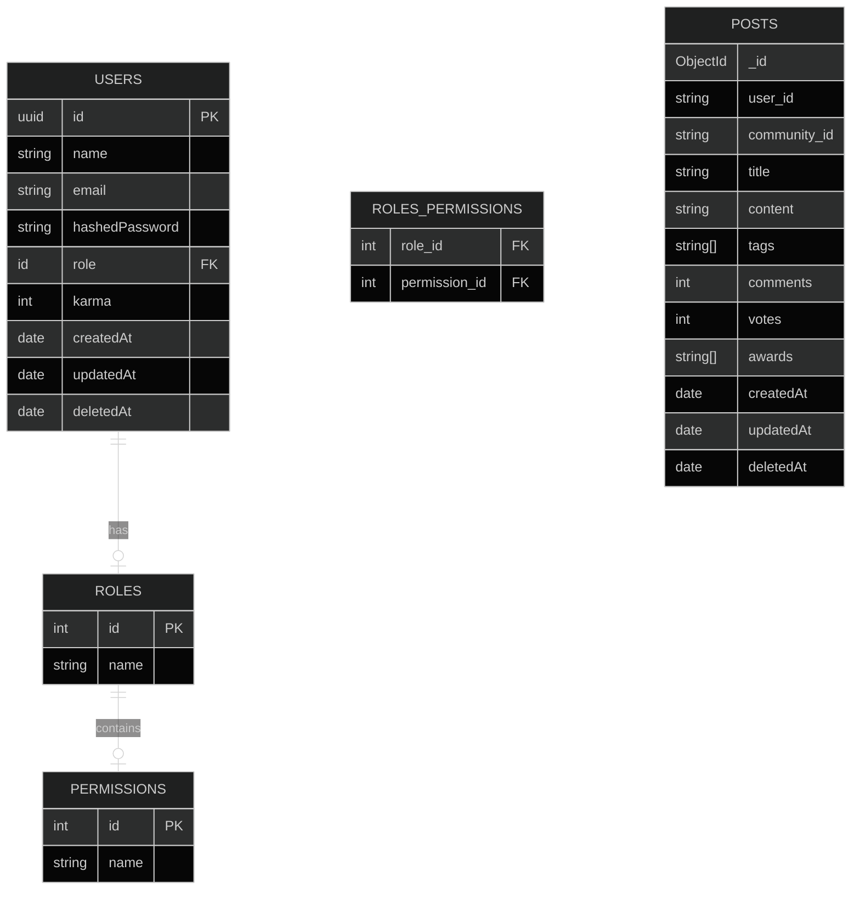

**Build your community brick by brick.** \
(Starting this project on 2025/03/07)

---
# Stack
Stacks are rated by knowledge and comfort level. Some of this ratings are what i **believe** and not what i know, so take it with a grain of salt. \
⏫ I'm comfortable with this. \
🔼 I'm ok with this. \
⏺️ I'm not sure. \
🔽 I will struggle. \
⏬ I will struggle a lot and take much more time.

By the end of March i'll (hopefuly) have all my stacks decided.

## Backend
- ASP.NET Core ⏺️ 🥇
- Java Spring Boot ⏬ 🥈
- Ruby on Rails ⏬
- Laravel ⏬
- NestJS ⏫ 🥉

## Frontend
- Svelte 🔼
- Vue ⏫️ ✅
- Blazor ⏺️
- React Native ⏬
- React 🔽

## Databases
### SQL
- PostgreSQL ⏫ ✅
- Oracle ⏬

### noSQL
- MongoDB ⏫ ✅
- ScyllaDB ⏬
- Cassandra ⏬

### Data Visualization
- PGAdmin ⏫ ✅
- Adminer 🔼
- TablePlus ⏺️

## Reverse Proxy (Do i even need it for this project?)
- Nginx ⏬
- Apache HTTP Server ⏬

## Containers
- Docker 🔼 ✅
- Kubernetes 🔽

## Future plans
- Grafana
- CI/CD with Github Actions
- ?

## Entity Relationship Diagram

